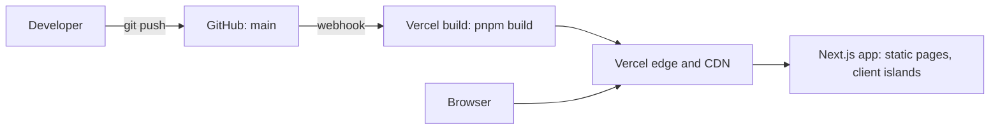

# Specter & Ops — DevOps Society × Suits

A landing page for the **DevOps Society at Bennett University**, run like a Manhattan law firm. Built for round 2 of the society's recruitment: *create a club website, DevOps x Suits, with a landing page, team details and what the club is about, using dummy data.*

**Live:** https://devops-soc-round2.vercel.app

> **All names, numbers, events and contact details on this site are dummy data.** Character names and quotes are a nod to the TV series *Suits*. This project is not affiliated with any real law firm or with the show.

Built by **Manvendra**.

---

## The idea

Every DevOps concept is mapped to a legal one, so the site reads like a firm's website and works like a DevOps demo:

| Legal | DevOps |
| --- | --- |
| Litigation | CI/CD pipelines |
| Corporate law | Containers and orchestration |
| Real estate | Cloud infrastructure |
| Contract law | Infrastructure as code |
| Discovery | Observability |
| Crisis management | Incident response and SRE |

## Sections

| Section | What it does |
| --- | --- |
| **Hero** | Headline plus an animated "docket" terminal that replays a CI run |
| **Quote ticker** | Marquee of firm sayings |
| **The Brief** | What the society is about, written as a legal document |
| **Practice Areas** | The six specialties and the tools taught in each |
| **Case Files** | Events and projects as court cases, filterable by verdict (Won, Pending, Settled, Lost) |
| **Exhibit A: Motion to Deploy** | Interactive CI/CD pipeline simulation |
| **The Partners** | Team details as flip cards: name partners, senior partners, associates |
| **Exhibit B: The Deposition** | A working terminal you can type into |
| **Retain the Firm** | Join form (front-end only, no backend) |

## Things to try

- **Motion to Deploy:** turn on *Opposing counsel*, file a motion, and rule on the failed test yourself. Overrule to retry, or settle to roll back.
- **Command palette:** press `Ctrl K` (or `Cmd K`).
- **Deposition shell:** try `help`, `kubectl get partners`, `kubectl describe partner litt`, `git log`, `quote`, `deploy` and `sudo hire-me`. Tab autocompletes, ↑ and ↓ scroll history, `Ctrl L` clears.
- **Easter egg:** enter the Konami code (`↑ ↑ ↓ ↓ ← → ← → B A`).

## Tech stack

- [Next.js](https://nextjs.org) 16 (App Router) and React 19
- TypeScript
- Tailwind CSS v4 with design tokens in `@theme inline`
- `next/font` for Geist, Geist Mono and Instrument Serif
- `lucide-react` icons
- Deployed on Vercel

## Architecture



The site is static. There is no database and no API routes; all data lives in `lib/firm-data.ts`.

## Getting started

Requirements: Node.js 20 or newer and [pnpm](https://pnpm.io).

```bash
git clone https://github.com/0xmaxw08/devops-soc-round2.git
cd devops-soc
pnpm install
pnpm dev
```

Open http://localhost:3000.

```bash
pnpm build   # production build
pnpm start   # serve the production build
```

## Project structure

```
app/
  layout.tsx            fonts, metadata, viewport
  page.tsx              composes all sections
  globals.css           Tailwind v4 theme tokens (ink, paper, gold, signal)
components/site/
  hero.tsx, docket-terminal.tsx
  quote-ticker.tsx
  the-brief.tsx
  practice-areas.tsx
  case-files.tsx
  motion-to-deploy.tsx  pipeline state machine
  partners.tsx, partner-card.tsx
  deposition.tsx        terminal shell
  retainer.tsx          join form
  command-palette.tsx
  site-header.tsx, site-footer.tsx, section-label.tsx, monogram.tsx
lib/
  firm-data.ts          partner data and event names (dummy)
  utils.ts              cn() helper
public/images/          hero and Brief photos
```

## Design decisions

**Window events instead of global state.** The command palette, the Motion to Deploy section and the terminal need to trigger each other (for example, `deploy` in the terminal starts the pipeline). `emitFirmEvent` dispatches a `CustomEvent` on `window`, and each component subscribes to the events it cares about. The event names live in one object, `firmEvents`, so they are typed and can't drift apart. No state library was needed for this.

**Server components by default.** Sections with no interactivity (Hero, The Brief, Practice Areas, Partners, footer) render on the server and ship no JavaScript of their own. Only components that need state, timers or event listeners are marked `'use client'`.

**Pipeline as a state machine.** In Motion to Deploy, `status` (idle, running, objection, won, settled) and `stage` drive a timeout per stage. With chaos mode on, the test stage fails and pauses for a ruling. Overrule retries with the flaky test quarantined; settle rolls back.

**Accessibility.** The palette uses combobox and listbox roles, the terminal output is a live `role="log"` region, partner cards work from the keyboard, IME composition is handled in the inputs, and `prefers-reduced-motion` is respected.

## How it was built

The brief asked for a site built with AI plus my own work. I generated the first version with v0 and then reviewed and edited it by hand: fixing bugs (pipeline restart during a run, marquee loop jump, card flip conflicts, terminal command parsing), cleaning up data inconsistencies, and removing scaffold branding.

## Roadmap

- [ ] `Dockerfile` (multi-stage, standalone output) and `docker-compose.yml`
- [ ] GitHub Actions workflow: typecheck, lint, build
- [ ] `/api/health` route and build info in the footer
- [ ] Move terminal logic into a pure `lib/shell.ts` with unit tests
- [ ] Retainer form backend with validation

## License

Dummy project for a society recruitment task. Not licensed for reuse of the *Suits* names or quotes.
